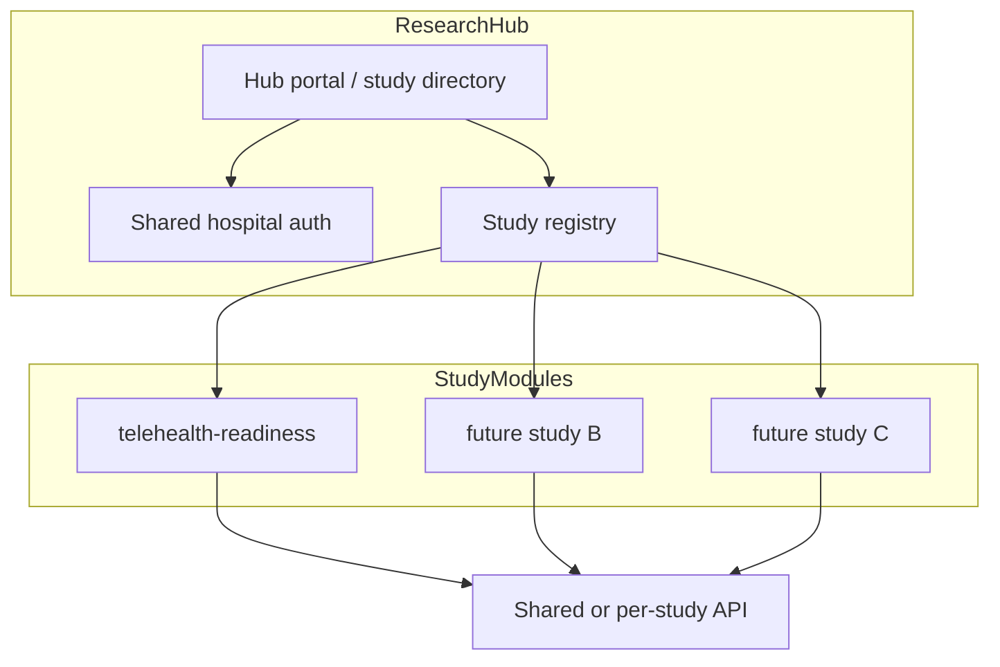

# AGA Health Foundation — Research Hub Roadmap

**Status:** Vision / not implemented  
**Last updated:** 2026-06-29  
**Prerequisite:** Telehealth readiness pilot improvements complete ([pilot-improvement-plan.md](./pilot-improvement-plan.md))

---

## 1. What the hub is

A **single hospital-facing platform** where AGA Health Foundation staff can:

- Discover active and past research studies
- Enroll participants or share study links
- Access study-specific admin dashboards and reports
- Manage access with **one hospital login**, not per-study secrets

The **telehealth readiness survey** is the **first study module**, not the whole platform.

---

## 2. What exists today (pilot)

| Component | Role |
|-----------|------|
| `artifacts/telehealth-survey` | Public survey + admin UI for one study |
| `artifacts/api-server` | REST API + database access |
| `surveys` table | Responses for telehealth readiness only |
| Shared admin key → **moving to session auth in pilot Phase 2** | Temporary |

---

## 3. Target hub architecture

### Likely building blocks (when hub work starts)

| Piece | Description |
|-------|-------------|
| `artifacts/research-hub` | Shell app: study directory, hospital branding, global nav |
| Study modules | One folder/artifact per study (start by extracting telehealth patterns) |
| `studies` registry table | `slug`, `title`, `status`, `opens_at`, `closes_at`, `pi_name`, `ethics_ref` |
| Shared auth | Extend pilot `admin_users` to hub-level roles + study-scoped permissions |
| Per-study data | Separate tables or `study_slug` partition (pilot adds `study_slug` early) |

---

## 4. Principles for getting there without rework

These are **why** the pilot improvement plan namespaces under `telehealth-readiness`:

1. **Study slug everywhere** — routes, API paths, DB `study_slug` column.
2. **Config-driven study metadata** — ethics, PI, dates in config/registry, not hardcoded in components.
3. **Auth that can grow** — session + roles in pilot become hub auth; avoid new per-study keys.
4. **Export and audit from day one** — named users and export logs before hub scales.
5. **Do not extract shared libraries until study #2** — avoid premature abstraction.

---

## 5. Explicitly out of scope until hub phase

- Multi-study participant portal at hospital root URL
- Study creation wizard for non-technical staff
- Cross-study analytics (“all AGA research 2026”)
- Integration with hospital EMR / patient records
- SMS/WhatsApp recruitment pipelines
- Bilingual (English + local language) platform shell
- Automated scheduled reports to leadership

---

## 6. Suggested hub phases (future)

| Phase | Deliverable |
|-------|-------------|
| H1 | Hub shell + study directory page listing telehealth readiness |
| H2 | Study registry in DB; telehealth module mounted under hub routes |
| H3 | Second study module (validates extraction pattern) |
| H4 | Study-scoped permissions; hospital SSO evaluation |
| H5 | Cross-study reporting for research leadership |

**Do not start H1 until the telehealth pilot is signed off by the hospital** ([presentation checklist](./pilot-improvement-plan.md#10-hospital-presentation-checklist-all-phases)).

---

## 7. Open questions (resolve before hub build)

1. Will each study keep its **own database table** or share one `responses` table with `study_slug`?
2. Should participants see a **hospital research home page** or only direct study links?
3. Who **creates new studies** — IT only, or research coordinators via UI?
4. Is **Ghana Data Protection Act** compliance review required at hub scale?
5. Hosting: stay on Replit, move to hospital-managed cloud, or hybrid?

---

## 8. Change log

| Date | Change |
|------|--------|
| 2026-06-29 | Initial roadmap stub created alongside pilot improvement plan |
