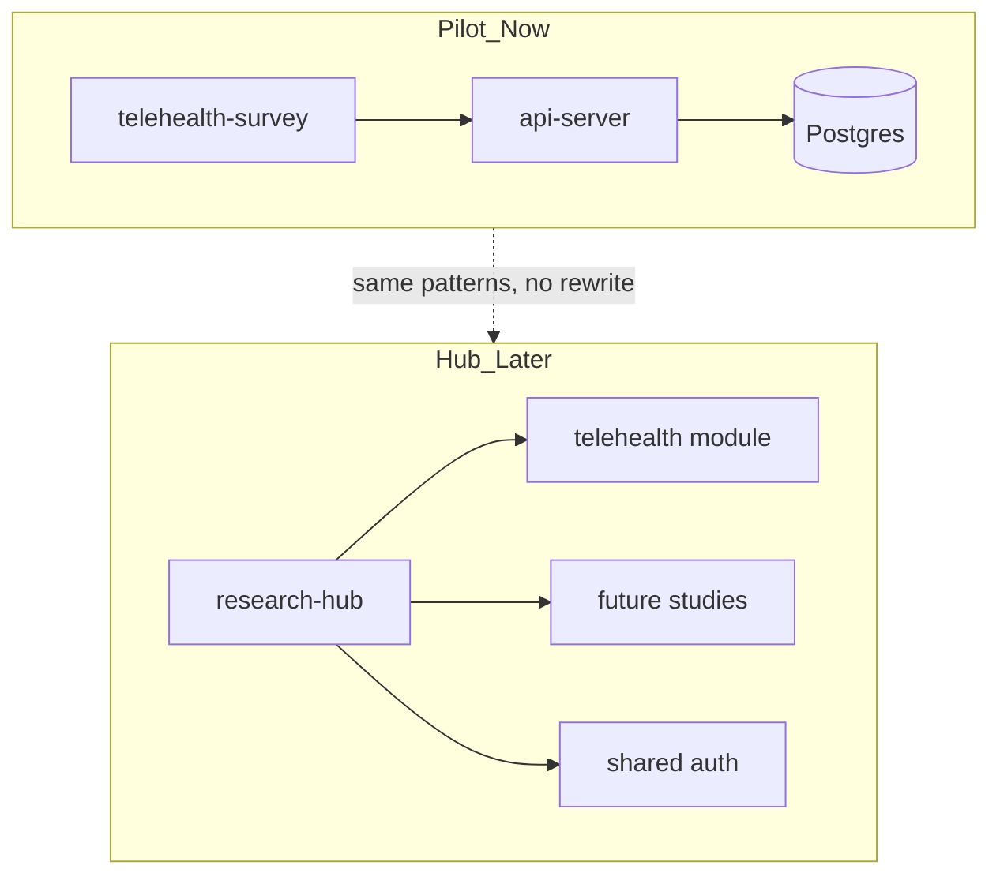

# Telehealth Readiness Pilot — Improvement Plan

**Status:** Implemented (2026-06-29)  
**Last updated:** 2026-06-29  
**Owner:** AGA Health Foundation research team  
**Related docs:** [system-architecture.md](./system-architecture.md) · [hub-roadmap.md](./hub-roadmap.md)

---

## 1. Purpose

This document is the **working reference** for improving the telehealth readiness **pilot** before hospital presentation and before building a broader **research hub**.

### Goals

1. Make the pilot **presentable and trustworthy** to AGA Health Foundation leadership.
2. Give the research team **usable reporting** (not just raw rows).
3. Keep the telehealth study **separate and portable** so future studies can be added without rewriting this one.
4. **Do not** build the multi-study research hub in this pass — only document the path forward.

### Non-goals (deferred)

- Multi-study landing page or study registry UI
- Second research study implementation
- EMR integration, bilingual UI, automated email digests
- Full enterprise IAM (SSO/LDAP) — revisit when the hub is built

---

## 2. Current state (baseline)

| Area | Today | Gap |
|------|--------|-----|
| Public survey | 8-section flow + informed consent | Ethics/IRB details are placeholders; no collection window |
| Admin | 4 stat cards + paginated table + detail view | No charts, filters in UI, or export; stats API loads all rows |
| Auth | Shared `ADMIN_KEY` in header / `localStorage` | Not hospital-grade; no named users or audit trail |
| URLs | `/`, `/survey`, `/admin` | Not namespaced per study |
| API | `/api/surveys`, `/api/surveys/stats` | Not namespaced; limited filters |
| Docs | `system-architecture.md`, `replit.md` | `replit.md` overstates admin filters; no pilot ops guide |
| Tests | None | No regression safety net |

---

## 3. Architecture direction

### Pilot now

```
telehealth-survey (frontend)  →  api-server  →  PostgreSQL (surveys table)
```

### Research hub later

```
research-hub (shell, shared auth, study registry)
  ├── telehealth-readiness module  (this pilot, extracted patterns)
  ├── future-study-b module
  └── future-study-c module
```



**Separation rule:** Namespace routes and APIs under `telehealth-readiness`. Keep **redirects** from legacy paths (`/`, `/survey`, `/admin`) so existing Replit links and QR codes keep working.

---

## 4. Phased delivery

| Phase | Focus | Est. effort | Depends on |
|-------|--------|-------------|------------|
| **1** | Structural separation | 1–2 days | — |
| **2** | Named-user admin auth | 2–3 days | Phase 1 |
| **3a** | Governance (ethics, privacy docs) | 1–2 days | Phase 2 |
| **3b** | Hardening (rate limit, survey window) | 1–2 days | Phase 2 |
| **4** | Admin analytics & export | 3–4 days | Phase 2 (auth for exports) |

Phases 3a and 3b can run in parallel after Phase 2.

---

## 5. Phase 1 — Structural separation

**Outcome:** Code and URLs clearly identify this as one study module; behaviour unchanged for participants.

### 5.1 Canonical URLs (frontend)

| Canonical path | Page |
|----------------|------|
| `/studies/telehealth-readiness` | Landing |
| `/studies/telehealth-readiness/survey` | Questionnaire |
| `/studies/telehealth-readiness/admin` | Dashboard |
| `/studies/telehealth-readiness/admin/responses/:id` | Response detail |

**Legacy aliases (redirect, do not remove):** `/`, `/survey`, `/admin`, `/admin/survey/:id`

**Files:** `artifacts/telehealth-survey/src/App.tsx`

### 5.2 API namespacing (backend)

| Canonical API | Notes |
|---------------|--------|
| `POST /api/studies/telehealth-readiness/surveys` | Public submit |
| `GET /api/studies/telehealth-readiness/surveys` | Admin list |
| `GET /api/studies/telehealth-readiness/surveys/stats` | Admin stats |
| `GET /api/studies/telehealth-readiness/surveys/:id` | Admin detail |

**Deprecated aliases:** existing `/api/surveys*` paths (same handlers) until hub work.

**Files:** `artifacts/api-server/src/routes/`, `lib/api-spec/openapi.yaml` → run codegen

### 5.3 Code layout

```
artifacts/telehealth-survey/src/
  studies/
    telehealth-readiness/
      pages/          ← Landing, Survey, Admin*, Detail (moved)
      config.ts       ← study metadata (Phase 3)
  components/         ← shared UI (AdminLayout, shadcn)
  context/            ← auth (Phase 2)
```

### 5.4 Database

- Add `study_slug` column on `surveys`, default `'telehealth-readiness'`.
- **Do not** rename the `surveys` table during active collection.

**Files:** `lib/db/src/schema/surveys.ts` → `pnpm --filter @workspace/db run push`

### 5.5 Docs added in this phase

- `docs/pilot/telehealth-readiness.md` — ops guide (URLs, env, roles)
- `docs/hub-roadmap.md` — future hub vision only

### Phase 1 checklist

- [ ] Canonical routes live with legacy redirects
- [ ] Canonical API paths live with legacy aliases
- [ ] Study code under `src/studies/telehealth-readiness/`
- [ ] `study_slug` column migrated
- [ ] Pilot ops doc + hub roadmap doc written
- [ ] `pnpm run typecheck` passes
- [ ] Verified on local + Replit

---

## 6. Phase 2 — Named-user admin auth

**Outcome:** Research team logs in with email/password; shared admin key removed.

### 6.1 Database

**Table `admin_users`**

| Column | Type | Notes |
|--------|------|--------|
| id | serial | PK |
| email | text | unique |
| password_hash | text | bcrypt |
| name | text | display name |
| role | text | `viewer` \| `analyst` \| `admin` |
| created_at | timestamp | |

**Sessions:** `express-session` with PostgreSQL store; `SESSION_SECRET` env var.

### 6.2 Roles

| Role | Permissions |
|------|-------------|
| `viewer` | Read stats, list, detail |
| `analyst` | viewer + CSV export |
| `admin` | analyst + manage users (seed/bootstrap in pilot) |

### 6.3 API

| Method | Path | Auth |
|--------|------|------|
| POST | `/api/auth/login` | Public |
| POST | `/api/auth/logout` | Session |
| GET | `/api/auth/me` | Session |

Replace `requireAdmin` / `x-admin-key` on all study read/export endpoints with `requireAuth` + role guard.

### 6.4 Frontend

- New login page: `/studies/telehealth-readiness/admin/login`
- `AdminProvider` uses `/api/auth/me` (session cookie), not `localStorage`
- Remove admin login button from public landing header

### 6.5 Bootstrap

Env vars for first deploy:

```env
SESSION_SECRET=...
INITIAL_ADMIN_EMAIL=...
INITIAL_ADMIN_PASSWORD=...
```

One-time seed on server start or dedicated script.

### Phase 2 checklist

- [ ] `admin_users` table + session store
- [ ] Login/logout/me endpoints
- [ ] All admin survey routes require session
- [ ] Frontend login page; no localStorage key
- [ ] `ADMIN_KEY` / `x-admin-key` deprecated
- [ ] `.env.example` updated
- [ ] Tested local + Replit with `SESSION_SECRET` in Secrets

---

## 7. Phase 3a — Governance

**Outcome:** Participants and hospital reviewers see complete, accurate study information.

### 7.1 Study config (`studies/telehealth-readiness/config.ts`)

Hospital team fills in:

- Study title (full)
- Principal investigator name
- Ethics / IRB approval reference
- Contact email and phone for questions
- Data retention period
- Last reviewed date

### 7.2 UI wiring

- Landing page footer and “About” section
- Informed consent block in survey (Step 0)

### 7.3 Hospital-facing documents

| Document | Purpose |
|----------|---------|
| `docs/pilot/privacy-and-data-handling.md` | Data flow, anonymity, retention, access |
| `docs/pilot/study-summary-for-hospital.md` | 1-page printable brief template |

Optional: hospital logo in `artifacts/telehealth-survey/public/` when asset is provided.

### Phase 3a checklist

- [ ] Config file with all required fields (placeholders OK until hospital signs off)
- [ ] Landing + consent display config values
- [ ] Privacy memo drafted
- [ ] Study summary template drafted
- [ ] Hospital reviewer walkthrough scheduled

---

## 8. Phase 3b — Hardening

**Outcome:** Safer public endpoint; controlled collection period.

### 8.1 Survey collection window

Env or `study_settings` table:

```env
SURVEY_OPENS_AT=2026-01-01T00:00:00Z
SURVEY_CLOSES_AT=2026-12-31T23:59:59Z
```

- API returns `403` with clear message outside window
- Frontend shows “collection closed” on landing and survey routes

### 8.2 Rate limiting

- `express-rate-limit` on `POST` survey submit (e.g. 5 requests / IP / hour)

### 8.3 Spam reduction

- Honeypot field on survey form (server rejects if filled)
- Optional: minimum seconds on form before submit accepted

### 8.4 CORS

- Production: allow only Replit app URL + local dev origins

### Phase 3b checklist

- [ ] Collection window enforced API + UI
- [ ] Rate limit on submit
- [ ] Honeypot active
- [ ] CORS restricted in production
- [ ] Abuse test (rapid submit) verified

---

## 9. Phase 4 — Admin analytics & export

**Outcome:** Research team can filter, visualize, export, and print pilot results.

### 9.1 API

**Stats refactor:** SQL aggregates (`COUNT`, `GROUP BY`, `AVG`) — do not load all rows.

**Extended list filters:**

- `date_from`, `date_to`
- `employment_type`, `has_ncd`, `work_area`
- `min_willingness`

**New endpoints:**

- `GET .../surveys/export?format=csv` — `analyst`+ role; respects active filters
- `GET .../surveys/stats?date_from=&date_to=` — filtered dashboard stats

Run `pnpm --filter @workspace/api-spec run codegen` after OpenAPI changes.

### 9.2 Admin UI

**Dashboard enhancements (`AdminDashboard.tsx`):**

1. Filter bar (drives table + stats)
2. Charts (use existing `recharts`):
   - Demographics (age, gender, employment)
   - Digital access (smartphone, internet, video comfort)
   - Readiness (willingness distribution, telecare willingness)
   - Barriers (follow-up attendance, concern score averages)
3. Export CSV button
4. QR code in Share modal (`AdminLayout.tsx`)

**Optional separate route:** `/studies/telehealth-readiness/admin/analytics` if dashboard is crowded.

**Printable report:** `/studies/telehealth-readiness/admin/report` — print-styled summary for meetings.

### 9.3 Doc updates

- Fix `replit.md` “filterable table” claim
- Update `docs/system-architecture.md` auth and admin sections

### Phase 4 checklist

- [ ] Stats use SQL aggregates
- [ ] Filters work in UI and API
- [ ] Charts render correctly with live data
- [ ] CSV export downloads with filter applied
- [ ] QR code in share modal
- [ ] Printable report page
- [ ] Architecture docs updated

---

## 10. Hospital presentation checklist (all phases)

Use this before presenting to hospital leadership:

- [ ] Canonical study URL: `/studies/telehealth-readiness`
- [ ] Named admin accounts; default `aga-admin` key disabled
- [ ] Ethics/IRB reference and contact visible to participants
- [ ] Survey open/close dates configured
- [ ] Admin shows charts, filters, and CSV export
- [ ] Printable pilot report available
- [ ] Privacy memo and study summary in `docs/pilot/`
- [ ] Live demo on Replit with real (or anonymized sample) data
- [ ] Backup / data retention approach agreed with hospital IT

---

## 11. Risk register

| Risk | Likelihood | Impact | Mitigation |
|------|------------|--------|------------|
| Legacy links break after route change | Medium | High | Permanent redirects from `/`, `/survey`, `/admin` |
| Session auth fails cross-origin | Medium | Medium | Same-site cookies; proxy `/api` in local dev (already done) |
| Replit Secrets missing `SESSION_SECRET` | Medium | High | Document in `replit.md` and pilot ops guide |
| Scope creep into hub | High | Medium | Hub doc only; no second artifact until pilot sign-off |
| Stats slow at scale | Low (pilot) | Medium | SQL aggregates in Phase 4 |
| Hospital delays ethics metadata | Medium | Low | Placeholders in config; block go-live until filled |

---

## 12. Implementation order (summary)

```
Phase 1  Structure          → namespace routes/API, study folder, study_slug
    ↓
Phase 2  Auth               → sessions, admin_users, login page
    ↓
Phase 3a Governance    ┐
Phase 3b Hardening     ┘   (parallel)
    ↓
Phase 4  Analytics          → charts, filters, export, report
```

**Start implementation only after this document is reviewed and hospital placeholders (ethics ref, PI, contacts) are identified.**

---

## 13. Document map (after plan is executed)

```
docs/
  pilot-improvement-plan.md     ← this file (master plan)
  system-architecture.md        ← technical reference (update per phase)
  hub-roadmap.md                ← future multi-study vision (Phase 1)
  pilot/
    telehealth-readiness.md     ← ops runbook (Phase 1)
    privacy-and-data-handling.md
    study-summary-for-hospital.md
```

---

## 14. Change log

| Date | Change |
|------|--------|
| 2026-06-29 | Initial plan created from pilot review and hospital presentation requirements |
