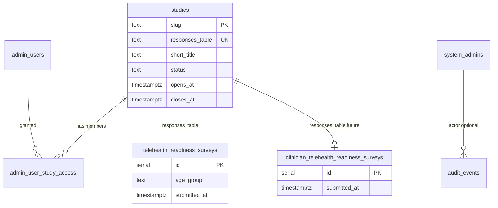

# Platform — Database Schema Design

**Status:** Implemented  
**Last updated:** 2026-07-05  
**Decisions:** [decisions.md](./decisions.md) — **one table per study**

---

## 1. Overview

Platform tables (`studies`, `system_admins`, `admin_user_study_access`) are shared. **Each study has its own responses table** — not a shared `surveys` table with `study_slug`.

The existing `surveys` table migrates to `telehealth_readiness_surveys` (study #1).

**Drizzle location:** `lib/db/src/schema/`

---

## 2. Entity relationship



---

## 3. Platform tables (shared)

### 3.1 `studies`

Registry of all research studies.

```ts
// lib/db/src/schema/studies.ts

export const studiesTable = pgTable("studies", {
  slug: text("slug").primaryKey(),
  responses_table: text("responses_table").notNull().unique(),
  short_title: text("short_title").notNull(),
  full_title: text("full_title").notNull(),
  organization: text("organization").notNull().default("AGA Health Foundation"),
  location: text("location"),
  principal_investigator: text("principal_investigator"),
  ethics_reference: text("ethics_reference"),
  contact_email: text("contact_email"),
  contact_phone: text("contact_phone"),
  data_retention: text("data_retention"),
  estimated_minutes: text("estimated_minutes"),
  status: text("status").notNull().$type<StudyStatus>().default("draft"),
  opens_at: timestamp("opens_at", { withTimezone: true }),
  closes_at: timestamp("closes_at", { withTimezone: true }),
  created_at: timestamp("created_at", { withTimezone: true }).notNull().defaultNow(),
  updated_at: timestamp("updated_at", { withTimezone: true }).notNull().defaultNow(),
});
```

| Column | Notes |
|--------|-------|
| `slug` | PK; URL segment `/studies/{slug}` |
| `responses_table` | Physical PostgreSQL table name for submissions |
| `status` | `draft` = system admin only; `active`/`paused` = public list |

**Convention:** `responses_table` = slug with hyphens → underscores + `_surveys` (e.g. `telehealth-readiness` → `telehealth_readiness_surveys`). Explicit column overrides convention when needed.

### 3.2 `system_admins`

Unchanged from prior design — platform operators.

### 3.3 `admin_user_study_access`

Unchanged — junction for study-team access per slug.

### 3.4 Prospectus tables (research intake)

See [research-prospectus.md](./research-prospectus.md).

| Table | Purpose |
|-------|---------|
| `prospectus_submissions` | Prospectus content + workflow status |
| `prospectus_reviews` | Review comments / revision requests |
| `prospectus_approvals` | Dual approval (`research_leadership`, `platform_ops`) |
| `prospectus_attachments` | Vercel Blob file metadata |

**`studies` additions:**

| Column | Notes |
|--------|-------|
| `prospectus_id` | FK → `prospectus_submissions.id`; required for new non-exempt studies |
| `prospectus_exempt` | `true` for studies created before prospectus gate |

Migration: `pnpm db:migrate:prospectus`

---

## 4. Per-study response tables

### 4.1 `telehealth_readiness_surveys` (study #1)

Migrates from current `surveys` table:

```sql
ALTER TABLE surveys RENAME TO telehealth_readiness_surveys;
ALTER TABLE telehealth_readiness_surveys DROP COLUMN IF EXISTS study_slug;
```

Drizzle schema file: `lib/db/src/schema/telehealth-readiness-surveys.ts` (rename from `surveys.ts`).

Column set unchanged from today's telehealth survey — demographics, NCD, follow-up, tech, awareness, willingness, concerns, suggestions, consent, `submitted_at`.

### 4.2 `clinician_telehealth_readiness_surveys` (study #2 — planned)

New table when study #2 ships. Schema TBD by clinician survey design — separate columns from employee survey.

```ts
// lib/db/src/schema/clinician-telehealth-readiness-surveys.ts (future)
export const clinicianTelehealthReadinessSurveysTable = pgTable(
  "clinician_telehealth_readiness_surveys",
  { /* study-specific columns */ },
);
```

### 4.3 API dispatch

API resolves study by slug from `studies`, validates `responses_table`, uses matching Drizzle table for INSERT/SELECT:

```ts
// Pseudocode — lib/db/src/study-tables.ts
const STUDY_TABLES = {
  "telehealth-readiness": telehealthReadinessSurveysTable,
  "clinician-telehealth-readiness": clinicianTelehealthReadinessSurveysTable,
} as const;
```

No dynamic SQL table names in v1 — registry `responses_table` must match a registered handler.

---

## 5. Existing tables — changes

### 5.1 `surveys` → `telehealth_readiness_surveys`

| Step | Action |
|------|--------|
| 1 | Rename table in migration `0003_rename_surveys` |
| 2 | Drop `study_slug` column (redundant per-study table) |
| 3 | Update Drizzle schema + API imports |
| 4 | Keep legacy `/api/surveys` as alias to telehealth-readiness only |

### 5.2 `admin_users`

No schema change. Study-scoped roles via `admin_user_study_access`.

### 5.3 `session`

Application-level `sessionKind` field — no DB schema change.

---

## 6. Seed data

### 6.1 Study registry rows

```sql
INSERT INTO studies (slug, responses_table, short_title, full_title, organization, location, status, estimated_minutes)
VALUES
  (
    'telehealth-readiness',
    'telehealth_readiness_surveys',
    'Telehealth Readiness Survey',
    'Assessment of Telehealth Readiness Among AGA Obuasi Mine Employees and Contractors',
    'AGA Health Foundation',
    'Obuasi Mine, Ghana',
    'active',
    '5–8'
  ),
  (
    'clinician-telehealth-readiness',
    'clinician_telehealth_readiness_surveys',
    'Clinician Telehealth Readiness Survey',
    'Assessment of Telehealth Readiness Among AGA Health Foundation Clinicians',
    'AGA Health Foundation',
    'Obuasi Mine, Ghana',
    'draft',
    NULL
  )
ON CONFLICT (slug) DO NOTHING;
```

Study #2 row seeded as `draft` until artifact and table exist.

### 6.2 Backfill study access

```sql
INSERT INTO admin_user_study_access (admin_user_id, study_slug, role)
SELECT id, 'telehealth-readiness', role
FROM admin_users
WHERE status = 'approved'
ON CONFLICT DO NOTHING;
```

---

## 7. Schema file layout (after implementation)

```
lib/db/src/schema/
├── index.ts
├── studies.ts
├── system-admins.ts
├── admin-users.ts
├── admin-user-study-access.ts
├── sessions.ts
├── telehealth-readiness-surveys.ts    # was surveys.ts
└── clinician-telehealth-readiness-surveys.ts  # future
```

---

## 8. Migration sequence

| Order | Migration | Contents |
|-------|-----------|----------|
| `0000` | `baseline` | Current schema snapshot (`surveys`, `admin_users`, `session`) |
| `0001` | `platform_core` | `studies`, `system_admins`, `admin_user_study_access` |
| `0002` | `seed_studies` | Registry rows for telehealth + clinician (draft) |
| `0003` | `rename_surveys` | `surveys` → `telehealth_readiness_surveys`; drop `study_slug` |
| `0004` | `clinician_table` | Create `clinician_telehealth_readiness_surveys` when study #2 starts |

---

## 9. Validation rules

| Rule | Enforcement |
|------|-------------|
| `responses_table` must match registered Drizzle table | API startup check |
| Cannot archive study without retention policy documented | System admin UI warning |
| Cannot hard-delete table with rows | Soft-archive study only |
| `draft` studies | Excluded from `GET /api/studies` |
| `paused` | Listed publicly; reject new POSTs |

---

## 10. Change log

| Date | Change |
|------|--------|
| 2026-07-02 | Initial platform schema design |
| 2026-07-02 | Per-study tables; rename surveys; study #2 registry |
