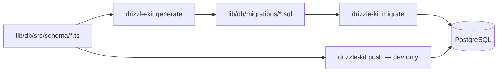

# Platform — Drizzle Migrations & Scripts

**Status:** Design (pre-implementation)  
**Last updated:** 2026-07-02

---

## 1. Problem statement

Today the project uses **Drizzle Kit `push` only** — no versioned SQL migration history:

```bash
pnpm --filter @workspace/db run push
```

This works for a single-developer pilot but fails at platform scale because:

- Replit dev DB, local laptop, and production can drift independently
- There is no auditable record of what changed when
- Moving to Render/Railway requires reproducible schema apply on a fresh Neon instance

**Goal:** Adopt **versioned SQL migrations** while keeping Drizzle schema as the source of truth.

---

## 2. Target workflow



| Command | When to use |
|---------|-------------|
| `generate` | After editing schema — produces new `.sql` migration |
| `migrate` | Apply pending migrations to target database |
| `push` | **Local dev only** — quick iteration; never production |
| `studio` | Inspect DB (optional) |

---

## 3. Directory layout (to create)

```
lib/db/
├── drizzle.config.ts
├── package.json
├── migrations/
│   ├── meta/
│   │   ├── _journal.json
│   │   └── 0000_snapshot.json
│   ├── 0000_baseline.sql
│   ├── 0001_platform_core.sql
│   ├── 0002_seed_studies.sql
│   └── 0003_rename_surveys.sql
├── scripts/
│   ├── migrate.ts              # programmatic migrate runner
│   ├── seed-telehealth.ts      # idempotent seed
│   └── baseline-from-push.md   # one-time instructions
└── src/
    └── schema/
```

---

## 4. `drizzle.config.ts` changes (planned)

```ts
import { defineConfig } from "drizzle-kit";

export default defineConfig({
  schema: "./src/schema/*.ts",
  out: "./migrations",
  dialect: "postgresql",
  dbCredentials: {
    url: process.env.DATABASE_URL!,
  },
});
```

---

## 5. `package.json` scripts (planned)

Add to `lib/db/package.json`:

```json
{
  "scripts": {
    "generate": "drizzle-kit generate --config ./drizzle.config.ts",
    "migrate": "drizzle-kit migrate --config ./drizzle.config.ts",
    "push": "drizzle-kit push --config ./drizzle.config.ts",
    "push-force": "drizzle-kit push --force --config ./drizzle.config.ts",
    "studio": "drizzle-kit studio --config ./drizzle.config.ts",
    "seed:telehealth": "tsx ./scripts/seed-telehealth.ts",
    "db:check": "drizzle-kit check --config ./drizzle.config.ts"
  }
}
```

Root `package.json` convenience aliases:

```json
{
  "scripts": {
    "db:generate": "pnpm --filter @workspace/db run generate",
    "db:migrate": "pnpm --filter @workspace/db run migrate",
    "db:push": "pnpm --filter @workspace/db run push",
    "db:seed": "pnpm --filter @workspace/db run seed:telehealth"
  }
}
```

---

## 6. Migration files (planned content)

### `0000_baseline.sql`

Captures **current** schema before platform tables:

- `surveys` (with `study_slug`)
- `admin_users`
- `session`

**How to produce:**

1. On a DB that matches production, run `drizzle-kit generate` with only existing schema files
2. Or use `drizzle-kit pull` once to introspect, then reconcile with schema files
3. Review SQL manually — ensure no destructive drops

If production already has these tables, `0000` is marked applied via baseline insert into `drizzle.__drizzle_migrations` (see §8).

### `0001_platform_core.sql`

```sql
CREATE TABLE IF NOT EXISTS "studies" (
  "slug" text PRIMARY KEY NOT NULL,
  "short_title" text NOT NULL,
  "full_title" text NOT NULL,
  "organization" text DEFAULT 'AGA Health Foundation' NOT NULL,
  "location" text,
  "principal_investigator" text,
  "ethics_reference" text,
  "contact_email" text,
  "contact_phone" text,
  "data_retention" text,
  "estimated_minutes" text,
  "status" text DEFAULT 'draft' NOT NULL,
  "opens_at" timestamp with time zone,
  "closes_at" timestamp with time zone,
  "created_at" timestamp with time zone DEFAULT now() NOT NULL,
  "updated_at" timestamp with time zone DEFAULT now() NOT NULL
);

CREATE INDEX IF NOT EXISTS "studies_status_idx" ON "studies" ("status");

CREATE TABLE IF NOT EXISTS "system_admins" (
  "id" serial PRIMARY KEY NOT NULL,
  "email" text NOT NULL,
  "password_hash" text NOT NULL,
  "name" text NOT NULL,
  "created_at" timestamp with time zone DEFAULT now() NOT NULL,
  "last_login_at" timestamp with time zone
);

CREATE UNIQUE INDEX IF NOT EXISTS "system_admins_email_uidx" ON "system_admins" ("email");

CREATE TABLE IF NOT EXISTS "admin_user_study_access" (
  "id" serial PRIMARY KEY NOT NULL,
  "admin_user_id" integer NOT NULL,
  "study_slug" text NOT NULL,
  "role" text NOT NULL,
  "granted_at" timestamp with time zone DEFAULT now() NOT NULL,
  "granted_by_system_admin_id" integer,
  CONSTRAINT "admin_user_study_access_admin_user_id_fkey"
    FOREIGN KEY ("admin_user_id") REFERENCES "admin_users"("id") ON DELETE cascade,
  CONSTRAINT "admin_user_study_access_study_slug_fkey"
    FOREIGN KEY ("study_slug") REFERENCES "studies"("slug") ON DELETE cascade,
  CONSTRAINT "admin_user_study_access_granted_by_fkey"
    FOREIGN KEY ("granted_by_system_admin_id") REFERENCES "system_admins"("id") ON DELETE set null
);

CREATE UNIQUE INDEX IF NOT EXISTS "admin_user_study_access_user_study_uidx"
  ON "admin_user_study_access" ("admin_user_id", "study_slug");

CREATE INDEX IF NOT EXISTS "admin_user_study_access_study_slug_idx"
  ON "admin_user_study_access" ("study_slug");
```

### `0003_rename_surveys.sql`

```sql
ALTER TABLE IF EXISTS surveys RENAME TO telehealth_readiness_surveys;
ALTER TABLE telehealth_readiness_surveys DROP COLUMN IF EXISTS study_slug;
```

Update `studies.responses_table = 'telehealth_readiness_surveys'` for `telehealth-readiness` row.

### `0002_seed_studies.sql`

Idempotent seed — see [database-schema.md](./database-schema.md) §6.

Prefer **TypeScript seed script** (`seed-telehealth.ts`) for complex logic; SQL seed acceptable for static INSERTs.

---

## 7. Day-to-day developer workflow

### Change schema

1. Edit `lib/db/src/schema/*.ts`
2. Run `pnpm db:generate` — review generated SQL in `migrations/`
3. Run `pnpm db:migrate` against local `DATABASE_URL`
4. Commit schema + migration SQL together
5. Run `pnpm run typecheck` and API tests

### Fresh clone setup

```bash
pnpm install
cp .env.example .env   # set DATABASE_URL to Neon dev branch
pnpm db:migrate
pnpm db:seed
pnpm run dev
```

### Never in production

```bash
# DO NOT run push against production
pnpm db:push   # local only
```

---

## 8. Baseline existing databases (one-time)

Production and Replit DBs may already have `surveys`, `admin_users`, `session` from prior `push` runs.

**Option A — mark baseline applied (recommended if schema matches):**

```sql
-- Ensure drizzle migration table exists (drizzle-kit migrate creates it)
-- Then insert baseline record WITHOUT running 0000 SQL:
INSERT INTO drizzle.__drizzle_migrations (id, hash, created_at)
VALUES (1, '<hash-from-0000>', EXTRACT(EPOCH FROM NOW()) * 1000)
ON CONFLICT DO NOTHING;
```

Then run `pnpm db:migrate` — only `0001` and `0002` apply.

**Option B — empty new Neon project:**

Run full `pnpm db:migrate` from `0000` upward.

**Verification:**

```bash
pnpm --filter @workspace/db run studio
# Confirm tables: studies, system_admins, admin_user_study_access,
# telehealth_readiness_surveys, admin_users, session
```

---

## 9. CI/CD integration (future)

Add to deploy pipeline (Render/Railway/Replit):

```bash
pnpm install --frozen-lockfile
pnpm db:migrate
pnpm run build
# start server — bootstrap system admin runs in API startup
```

Fail deploy if migrate exits non-zero.

---

## 10. API server startup hooks

After migrations, on boot:

1. `ensureSessionTable()` — keep until `0000` includes session table
2. `ensureBootstrapSystemAdmin()` — reads `SYSTEM_ADMIN_*` env
3. `ensureBootstrapAdminApproved()` — existing study-team recovery

Order: migrate (deploy step) → start API (bootstrap hooks).

---

## 11. Rollback policy

Drizzle does not auto-generate down migrations.

| Situation | Action |
|-----------|--------|
| Bad migration not yet deployed | Delete migration file, regenerate |
| Bad migration deployed | Write manual `0003_rollback_xxx.sql` or restore DB snapshot |
| Schema hotfix | Prefer forward migration `0003_fix_xxx.sql` |

Neon: use **branch restore** or point-in-time recovery for catastrophic failures.

---

## 12. Transition plan from `push` to `migrate`

| Step | Action | Owner |
|------|--------|-------|
| 1 | Freeze schema changes briefly | Dev |
| 2 | Create `migrations/` + `0000_baseline` from current schema | Dev |
| 3 | Document baseline marking for Replit prod | Dev |
| 4 | Apply `0001`–`0003` on dev DB | Dev |
| 5 | Create `research-hub` artifact; implement platform code | Dev |
| 6 | Mark baseline + migrate on Replit production | Ops |
| 7 | Update docs; `push` documented as dev-only | Dev |
| 8 | Add `db:migrate` to deploy | Ops |

---

## 13. Troubleshooting

| Symptom | Cause | Fix |
|---------|-------|-----|
| `relation already exists` on migrate | Baseline not marked | Use §8 Option A |
| Local schema differs from prod | Used `push` on one, migrate on other | Align via migrate on both; stop using push on prod |
| `helium` host unreachable locally | Replit-internal DB URL | Use Neon public URL in local `.env` |
| Migration hash mismatch | Edited committed SQL | Never edit applied migrations; add new forward migration |

---

## 14. Change log

| Date | Change |
|------|--------|
| 2026-07-02 | Initial migration plan |
