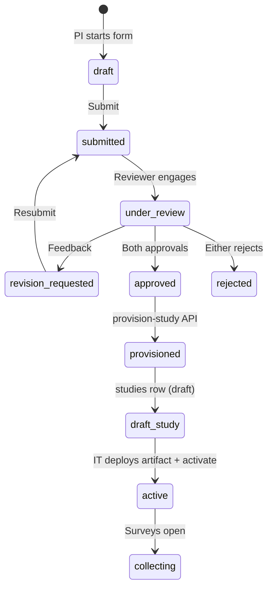

# Research Prospectus System

**Status:** Implemented (v1.1.0)  
**Last updated:** 2026-07-05  
**Related:** [decisions.md](./decisions.md) · [database-schema.md](./database-schema.md) · [system-admin.md](./system-admin.md)

---

## 1. Purpose

Every new research project on the AGA Health Foundation platform must begin with a **research prospectus** — a structured planning document outlining focus, significance, methodology, ethics, and timeline. Only after **dual approval** can the study be provisioned and eventually activated for participant collection.

This mirrors the academic dissertation prospectus gate: plan first, committee approves, then research proceeds.

**Non-goal:** Replacing hospital IRB/ethics processes outside the platform. The prospectus supports governance; ethics approval is recorded via `ethics_reference` fields.

---

## 2. Resolved decisions

| # | Decision | Choice |
|---|----------|--------|
| D1 | Approval model | **Dual approval** — `research_leadership` + `platform_ops` (both system admins in v1; separate reviewer roles later) |
| D2 | File storage | **Vercel Blob** — private blobs; metadata in `prospectus_attachments` |
| D3 | Post-approval edits | **No edits** — submit an **amendment** prospectus (`parent_prospectus_id`, `is_amendment: true`) |
| D4 | Slug assignment | Reviewer edits `proposed_slug` at **provision-study** time |
| D5 | Study templates | `study_template`: `telehealth-readiness-clone`, `clinician-clone`, or `custom` |
| D6 | Access model (v1) | **Magic link** via `public_id` UUID — no login required to draft/submit |
| D7 | Grandfathering | Existing studies (`telehealth-readiness`, `clinician-telehealth-readiness`) have `prospectus_exempt = true` |

---

## 3. Lifecycle



### Hard gates

1. `POST /api/system/prospectus/:id/provision-study` — only when `status = approved` (both dual approvals recorded).
2. `PATCH /api/system/studies/:slug` with `status: active` — blocked unless linked prospectus is approved or `prospectus_exempt`.
3. `POST /api/studies/{slug}/surveys` — blocked unless prospectus approved or exempt.

---

## 4. Dual approval

Two independent approvals stored in `prospectus_approvals`:

| Role | Who (v1) | Responsibility |
|------|----------|----------------|
| `research_leadership` | Research director / leadership system admin | Scientific merit, feasibility, ethics fit |
| `platform_ops` | Platform operator system admin | Technical feasibility, template selection, resource planning |

**Rules:**

- One row per `(prospectus_id, approval_role)` — upsert on re-decision.
- Any `rejected` decision → prospectus `status = rejected`.
- Both `approved` → `status = approved`, `approved_at` set.
- Same system admin may approve both roles in pilot (discouraged in production).

---

## 5. File storage (Vercel Blob)

| Item | Detail |
|------|--------|
| Package | `@vercel/blob` in `artifacts/api-server` |
| Env var | `BLOB_READ_WRITE_TOKEN` |
| Access | Blobs stored in Vercel Blob; **download via authenticated API proxy** (P3) — do not expose raw URLs publicly |
| Path pattern | `prospectus/{publicId}/{timestamp}-{filename}` |
| DB table | `prospectus_attachments` — filename, mime, size, `blob_pathname`, `blob_url` |
| Limits | 10 MB; PDF and Word only (v1) |
| Upload API | `POST /api/prospectus/{publicId}/attachments` (base64 body; multipart in UI phase) |

If `BLOB_READ_WRITE_TOKEN` is unset, attachment upload returns `503`.

---

## 6. Database tables

| Table | Purpose |
|-------|---------|
| `prospectus_submissions` | Full prospectus content + workflow status |
| `prospectus_reviews` | Comments and revision requests (non-binding) |
| `prospectus_approvals` | Dual approval decisions |
| `prospectus_attachments` | Vercel Blob metadata |
| `studies.prospectus_id` | FK to approved prospectus |
| `studies.prospectus_exempt` | Grandfather flag for pre-prospectus studies |

Drizzle schemas: `lib/db/src/schema/prospectus-*.ts`

Form template (field help): `lib/db/src/prospectus-template.ts`  
API: `GET /api/prospectus/template`

---

## 7. API map

### Public (token = `publicId`)

| Method | Path | Description |
|--------|------|-------------|
| GET | `/api/prospectus/template` | Form schema + help text |
| POST | `/api/prospectus` | Create draft |
| GET | `/api/prospectus/:publicId` | Read own submission |
| PATCH | `/api/prospectus/:publicId` | Update (draft / revision_requested only) |
| POST | `/api/prospectus/:publicId/submit` | Submit for review |
| POST | `/api/prospectus/:publicId/withdraw` | Withdraw |
| POST | `/api/prospectus/:publicId/attachments` | Upload to Vercel Blob |

### System admin

| Method | Path | Description |
|--------|------|-------------|
| GET | `/api/system/prospectus` | List (optional `?status=`) |
| GET | `/api/system/prospectus/:id` | Detail + reviews + approval slots |
| POST | `/api/system/prospectus/:id/reviews` | Comment / request revision |
| POST | `/api/system/prospectus/:id/approve` | Record dual-approval decision |
| POST | `/api/system/prospectus/:id/provision-study` | Create `studies` draft row |

OpenAPI: `lib/api-spec/openapi.yaml` (tags: `prospectus`, `system-prospectus`)

---

## 8. Frontend routes

| Path | Page | Auth |
|------|------|------|
| `/research/prospectus` | Landing + CTA | Public |
| `/research/prospectus/new` | Start draft (name, email, title) | Public |
| `/research/prospectus/:publicId` | Multi-step wizard + status | Magic link (`publicId`) |
| `/system/admin/prospectus` | Review queue | System admin |
| `/system/admin/prospectus/:id` | Detail + dual approve + provision | System admin |

Code: `artifacts/telehealth-survey/src/platform/pages/prospectus/` and `system-admin/Prospectus*.tsx`

### Submitter UX (v1.1.0)

| Control | Behaviour |
|---------|-----------|
| **Next** | Moves to the next section **without saving** — fast navigation through already-entered content |
| **Save draft** | Persists current answers; stay on the page |
| **Save & exit** | Saves, then returns to prospectus home — use when pausing work |
| **Save & submit for review** | Saves all answers and submits (final step) |

**Resume without login:** After creating a draft, bookmark or copy the tracking URL (`/research/prospectus/{publicId}`). Anyone with the link can view or edit while status is `draft` or `revision_requested`. There is no email lookup in v1 — losing the link requires admin assistance.

**Co-investigators:** Each row has **Name** and **Role** (preset dropdown: Co-PI, Statistician, Methodologist, etc.; “Other” allows custom text).

**Attachments:** Drag-and-drop or **Choose file** on the final step; PDF/Word, max 10 MB; client-side validation before upload.

Form state lives in the browser until an explicit save or submit — refreshing without saving loses unsaved edits.

---

## 9. Migrations

```bash
pnpm db:migrate:prospectus
```

Also runs on API startup via `ensure-prospectus-schema.ts` (idempotent).

Grandfather SQL:

```sql
UPDATE studies SET prospectus_exempt = true
WHERE slug IN ('telehealth-readiness', 'clinician-telehealth-readiness');
```

---

## 10. Environment variables

| Variable | Required for | Notes |
|----------|--------------|-------|
| `BLOB_READ_WRITE_TOKEN` | Attachment upload | From Vercel project → Storage → Blob |
| `DATABASE_URL` | All | Existing |
| `SESSION_SECRET` | System admin review | Existing |

---

## 11. Implementation phases

| Phase | Deliverable | Status |
|-------|-------------|--------|
| P0 | Plan doc, schema, migration, API scaffold | **Done** |
| P1 | Multi-step submitter UI + manual save | **Done** — Next navigates without save; Save draft / Save & exit / submit persist |
| P2 | System admin review UI + dual approval UX | **Done** |
| P3 | Attachment upload UI (drag-and-drop → Blob) | **Done** (base64 upload; Blob token required) |
| P4 | Email notifications | Not started |
| P5 | Amendment prospectus flow in UI | Not started |

---

## 12. Amendment policy

Approved prospectuses are **immutable**. To change scope after approval:

1. Submit new prospectus with `isAmendment: true` and `parentProspectusId` set.
2. Complete dual approval again.
3. Link to existing or new study row as appropriate (IT decision).

---

## 13. Related documentation

- [compliance.md](./compliance.md) — `identifiable_data` flag triggers manual review
- [conceptual-design.md](./conceptual-design.md) — platform architecture
- [hub-roadmap.md](../hub-roadmap.md) — phase H8 prospectus

---

## Change log

| Date | Change |
|------|--------|
| 2026-07-04 | Initial implementation: schema, API, dual approval, Vercel Blob |
| 2026-07-05 | v1.1.0 UX: manual save model, co-investigator role dropdown, drag-and-drop attachments, form stability fixes |
