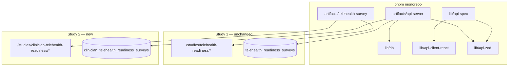

# Clinician Telehealth Readiness — Technical Plan (Study #2)

**Study slug:** `clinician-telehealth-readiness`  
**Status:** Design (pre-implementation)  
**Last updated:** 2026-07-02  
**Build gate:** Do **not** start implementation until study #1 (`telehealth-readiness`) is signed off by the hospital  
**Questionnaire spec:** [questionnaire.md](./questionnaire.md)

---

## 1. Executive summary

Study #2 adds a **clinician-facing survey module** to the existing monorepo — same API server, same web artifact, same admin auth pattern — with a **dedicated database table** and **namespaced routes**. It does not modify study #1 behaviour.

This plan follows [hub-roadmap.md](../../hub-roadmap.md) principle #5: *copy study #1 patterns; extract shared libraries only after study #2 exists.*

Optional platform work ([conceptual-design.md](../../platform/conceptual-design.md)) can proceed in parallel but is **not required** to ship study #2 using today's single-study patterns.

---

## 2. Goals & non-goals

### Goals

- Collect clinician responses via `/studies/clinician-telehealth-readiness/survey`
- Provide study-scoped admin dashboard, export, and aggregate stats
- Enable joint reporting with community arm (willingness gap analysis)
- Reuse session auth, approval workflow, and UI components from study #1

### Non-goals (study #2 v1)

- Merging clinician and community responses into one table
- Cross-study analytics UI on platform landing (`/`)
- Hospital SSO / EMR integration
- Twi-localized survey UI
- Real-time dashboards or SMS reminders
- System admin registry UI (unless platform phase is already complete)

---

## 3. Architecture placement



**Runtime:** Still two processes in dev (API `:8080`, Vite `:21409`). No new deployable artifact.

---

## 4. Study identity & URLs

| Item | Value |
|------|-------|
| Slug | `clinician-telehealth-readiness` |
| Short title | Clinician Telehealth Readiness Survey |
| Full title | Assessment of Telehealth Readiness Among Clinical Staff at AGA Health Foundation |
| Public landing | `/studies/clinician-telehealth-readiness` |
| Survey | `/studies/clinician-telehealth-readiness/survey` |
| Admin login | `/studies/clinician-telehealth-readiness/admin/login` |
| Admin dashboard | `/studies/clinician-telehealth-readiness/admin` |
| API base | `/api/studies/clinician-telehealth-readiness/` |

**Constant:**

```ts
// lib/db/src/constants.ts (add)
export const CLINICIAN_TELEHEALTH_STUDY_SLUG = "clinician-telehealth-readiness" as const;
```

---

## 5. Database design

### 5.1 Dedicated table (recommended)

Per [conceptual-design.md](../../platform/conceptual-design.md), study #2 uses its **own table** — not `surveys` with a different `study_slug` — because the column set differs substantially from the community instrument.

**File:** `lib/db/src/schema/clinician-telehealth-readiness-surveys.ts`

| Column group | Fields (from questionnaire.md) |
|--------------|--------------------------------|
| Meta | `id`, `submitted_at` |
| Section 1 | `clinical_role`, `clinical_role_other`, `department`, `department_other`, `years_in_clinical_practice`, `years_at_aga_health`, `telehealth_exposure_in_role` |
| Section 2 | `heard_of_telehealth`, `awareness_sources`, `used_telehealth_before`, `used_modalities`, `national_policy_awareness` |
| Section 3 | `confidence_*` (5 Likert fields) |
| Section 4 | `time_for_telehealth`, `documentation_burden_concern`, `workflow_integration`, `referral_pathway_clarity`, `team_coordination`, `comfort_clinical_decisions_remotely`, `comfort_patient_education_remotely` |
| Section 5 | `internet_at_workplace`, `power_reliability`, `device_availability`, `private_space_for_calls`, `facility_support` |
| Section 6 | `barrier_*` (6 Likert), `other_barriers`, `other_barriers_text` |
| Section 7 | `received_telehealth_training`, `training_needs`, `training_format_preference` |
| Section 8 | `willing_to_provide_telehealth`, `willing_ncd_telecare`, `willing_routine_review`, `willing_triage`, `preferred_modalities`, `willing_prescribe_after_remote`, `willing_remote_monitoring` |
| Section 9 | `suggestions` |
| Consent | `consent_given` |

**Storage conventions (match study #1):**

- Multi-select → comma-separated `text`
- Likert 1–5 → `text` (parsed to int in stats layer)
- Nullable role-branch fields when not shown

### 5.2 Registry row (when platform `studies` table exists)

Seed alongside study #1:

```sql
INSERT INTO studies (slug, responses_table, short_title, full_title, status, estimated_minutes, ...)
VALUES (
  'clinician-telehealth-readiness',
  'clinician_telehealth_readiness_surveys',
  ...,
  'draft',
  '10–15',
  ...
)
ON CONFLICT (slug) DO NOTHING;
```

Until platform ships: study metadata lives in `config.ts` only (same as study #1 today).

### 5.3 Migration

```bash
# After schema file added
pnpm --filter @workspace/db run push
```

Prefer a numbered SQL migration once platform migrations are standardised ([migrations-and-drizzle.md](../../platform/migrations-and-drizzle.md)).

---

## 6. API design

### 6.1 OpenAPI-first

Extend `lib/api-spec/openapi.yaml` with a new tag `ClinicianTelehealthReadiness` and paths:

| Method | Path | Auth | Description |
|--------|------|------|-------------|
| `GET` | `/studies/clinician-telehealth-readiness/status` | Public | Collection window |
| `POST` | `/studies/clinician-telehealth-readiness/surveys` | Public | Submit response |
| `GET` | `/studies/clinician-telehealth-readiness/surveys` | Study session + `admin` role | Paginated list |
| `GET` | `/studies/clinician-telehealth-readiness/surveys/stats` | Study session | Aggregate stats |
| `GET` | `/studies/clinician-telehealth-readiness/surveys/export` | Study session + `analyst` | CSV export |
| `GET` | `/studies/clinician-telehealth-readiness/surveys/{id}` | Study session | Response detail |

**Codegen:**

```bash
pnpm --filter @workspace/api-spec run codegen
```

### 6.2 Server routes

**New file:** `artifacts/api-server/src/routes/clinician-telehealth-readiness-surveys.ts`

Pattern: copy `surveys.ts` structure with:

- Zod validation from `@workspace/api-zod` generated schemas
- Insert into `clinicianTelehealthReadinessSurveysTable`
- Stats module: `artifacts/api-server/src/lib/clinician-survey-stats.ts`
- CSV export: extend or parallel `csv-export.ts`

**Mount in** `artifacts/api-server/src/routes/index.ts`:

```ts
router.use("/studies/clinician-telehealth-readiness", clinicianSurveysRouter);
```

### 6.3 Collection window

**Phase A (study #2 only):** Reuse env pattern with study-specific vars:

- `CLINICIAN_SURVEY_OPENS_AT`
- `CLINICIAN_SURVEY_CLOSES_AT`

**Phase B (with platform):** Read `studies.opens_at` / `closes_at` for slug `clinician-telehealth-readiness`.

### 6.4 Auth & access

**Short term:** Same `admin_users` table and session as study #1. Any approved admin can access both studies (document as known limitation).

**With platform:** `admin_user_study_access` grants per-study roles; middleware `requireStudyAccess('clinician-telehealth-readiness')` on clinician API routes.

---

## 7. Frontend module

### 7.1 Directory layout

Copy `artifacts/telehealth-survey/src/studies/telehealth-readiness/` → `studies/clinician-telehealth-readiness/`:

```
studies/clinician-telehealth-readiness/
├── config.ts              # Metadata, ethics, contact
├── paths.ts               # studyPaths helper
├── pages/
│   ├── LandingPage.tsx
│   ├── SurveyPage.tsx     # 10 sections per questionnaire.md
│   ├── AdminDashboard.tsx
│   ├── AdminReportPage.tsx
│   ├── AdminLoginPage.tsx # Thin wrapper or shared
│   ├── AdminRegisterPage.tsx
│   ├── AdminUsersPage.tsx
│   └── SurveyDetail.tsx
├── components/
│   ├── AnalyticsCharts.tsx
│   ├── FilterBar.tsx
│   └── AdminLoginForm.tsx # Re-export shared or duplicate minimally
└── lib/
    └── export-surveys.ts
```

### 7.2 Routing (`App.tsx`)

Add routes parallel to study #1:

```tsx
<Route path={clinicianPaths.landing} component={ClinicianLandingPage} />
<Route path={clinicianPaths.survey} component={ClinicianSurveyPage} />
<Route path={clinicianPaths.admin}>
  {() => <ProtectedAdminRoute component={ClinicianAdminDashboard} />}
</Route>
// ... admin sub-routes
```

### 7.3 Shared vs duplicated code

| Piece | Approach |
|-------|----------|
| UI primitives (`Button`, `Card`, shadcn) | Shared `@/components/ui` |
| `AdminLayout`, login forms | Shared until divergence forces split |
| Survey multi-step shell | Duplicate in study #2 first; extract `@workspace/study-shell` **only if** duplication hurts maintenance |
| Analytics charts | New chart config for clinician breakdowns (role, department, barrier index) |

### 7.4 Survey form implementation

- Zod schema mirrors [questionnaire.md](./questionnaire.md) field names
- Section components with `watch('clinical_role')` for branching
- Submit via `useSubmitClinicianSurvey` (generated hook)
- Map multi-select arrays → CSV strings before POST

---

## 8. Admin dashboard & analytics

### 8.1 Summary cards (v1)

| Card | Metric |
|------|--------|
| Total responses | `count(*)` |
| Mean willingness | Avg `willing_to_provide_telehealth` |
| Self-efficacy index | Mean of confidence fields |
| Facility readiness | Composite of section 5 |
| % willing NCD telecare | Compare headline to community study export |

### 8.2 Charts (`AnalyticsCharts.tsx`)

- Responses by `clinical_role`
- Responses by `department`
- Barrier index by domain (radar or bar)
- Willingness distribution (1–5)
- Training needs (multi-select breakdown)

### 8.3 Filters (`FilterBar.tsx`)

- `clinical_role`, `department`, date range (if `submitted_at` indexed)

### 8.4 Export

CSV with all raw columns + human-readable headers; filename `clinician-telehealth-readiness-export-YYYY-MM-DD.csv`.

---

## 9. Joint reporting (community + clinician)

Not a separate app — a **report section** or shared markdown template:

| Comparison | Community field | Clinician field |
|------------|-----------------|-----------------|
| NCD telecare willingness | `willing_for_ncd_telecare` | `willing_ncd_telecare` |
| Follow-up telecare | `willing_for_followup_telecare` | `willing_routine_review` |
| Overall willingness | `willing_to_use_telehealth` (1–5) | `willing_to_provide_telehealth` (1–5) |

**v1 delivery:** Manual comparison in pilot report (two CSV exports + spreadsheet).  
**v2:** Optional `AdminReportPage` section pulling both stats endpoints.

---

## 10. Implementation phases

### Phase 0 — Sign-off (no code)

- [ ] Hospital signs off study #1 pilot
- [ ] Ethics amendment for clinician arm approved
- [ ] PI signs off [questionnaire.md](./questionnaire.md)
- [ ] PI signs off this technical plan

### Phase 1 — Data layer (≈ 1–2 days)

- [ ] Add `clinician-telehealth-readiness-surveys.ts` schema
- [ ] Export from `lib/db/src/schema/index.ts`
- [ ] `pnpm --filter @workspace/db run push`
- [ ] Add `CLINICIAN_TELEHEALTH_STUDY_SLUG` constant

### Phase 2 — API contract (≈ 1 day)

- [ ] OpenAPI paths + schemas for clinician survey
- [ ] `pnpm --filter @workspace/api-spec run codegen`
- [ ] Implement routes + stats + CSV export
- [ ] Rebuild API bundle; verify with curl/Postman

### Phase 3 — Frontend survey (≈ 3–4 days)

- [ ] `config.ts`, `paths.ts`, `LandingPage`, `SurveyPage` (all sections + branching)
- [ ] Wire routes in `App.tsx`
- [ ] Collection status hook + closed-state UI

### Phase 4 — Admin UI (≈ 2–3 days)

- [ ] Dashboard, detail page, filters, charts
- [ ] Export button (analyst+)
- [ ] Pilot report page (clinician-specific copy)

### Phase 5 — QA & pilot (≈ 2 days)

- [ ] Typecheck + manual test matrix (see §12)
- [ ] Cognitive pilot with 5 clinicians
- [ ] Deploy to Replit; `db push` on production DB
- [ ] Hospital UAT sign-off

**Estimated total:** 9–12 dev days (single developer, copying study #1).

---

## 11. Environment variables

| Variable | Required | Notes |
|----------|----------|-------|
| `DATABASE_URL` | Yes | Shared |
| `SESSION_SECRET` | Yes | Shared |
| `CLINICIAN_SURVEY_OPENS_AT` | No | ISO datetime |
| `CLINICIAN_SURVEY_CLOSES_AT` | No | ISO datetime |

Add to `.env.example` when implementation starts.

---

## 12. Test matrix (pre-go-live)

| Scenario | Expected |
|----------|----------|
| Submit full survey as doctor | 200; role-branch fields saved |
| Submit as nurse | Doctor-only fields null |
| Submit with consent false | 400 |
| List responses without login | 401 |
| Export as viewer | 403 |
| Export as analyst | 200 CSV |
| Collection closed | POST 403/closed message |
| Approve pending admin | Can access clinician dashboard |

---

## 13. Deployment checklist (Replit / production)

1. Pull `main` after study #2 merge
2. `pnpm install`
3. `pnpm --filter @workspace/db run push`
4. `pnpm --filter @workspace/api-server run build`
5. Restart workflows
6. Verify `GET /api/studies/clinician-telehealth-readiness/status`
7. Smoke-test survey submit + admin list

---

## 14. Risks & mitigations

| Risk | Mitigation |
|------|------------|
| Admins conflated across studies | Document; add `admin_user_study_access` with platform phase |
| Table sprawl per study | Acceptable for 2–3 studies; generic `responses` JSONB only if 5+ studies |
| Questionnaire too long | Pilot cognitive testing; trim optional items |
| Low response rate | Unit-head champions; protected time; repeat reminders (out of band) |
| API bundle stale in dev | `dev-local.ps1` already rebuilds API on start |

---

## 15. Future extraction (after study #2 ships)

If a third study is planned, consider extracting:

| Library | Contents |
|---------|----------|
| `@workspace/study-shell` | Multi-step survey frame, consent block, progress bar |
| `@workspace/study-admin` | Responses table, filter bar, export hook |
| Shared stats utilities | Likert parsing, CSV multi-select breakdown |

Do **not** extract before study #2 is complete and stable.

---

## 16. Document index

| Document | Role |
|----------|------|
| [questionnaire.md](./questionnaire.md) | Research instrument (source of truth for fields) |
| [../../platform/conceptual-design.md](../../platform/conceptual-design.md) | Platform vision (optional for study #2 v1) |
| [../../pilot/telehealth-readiness.md](../../pilot/telehealth-readiness.md) | Study #1 ops reference |
| [../../hub-roadmap.md](../../hub-roadmap.md) | Why study #2 exists in this repo |

---

## 17. Sign-off

| Role | Name | Date | Approved |
|------|------|------|----------|
| Principal investigator | | | ☐ |
| Research coordinator | | | ☐ |
| Hospital IT / platform | | | ☐ |
| Ethics (reference #) | | | ☐ |

---

## 18. Change log

| Date | Change |
|------|--------|
| 2026-07-02 | Initial technical plan |
